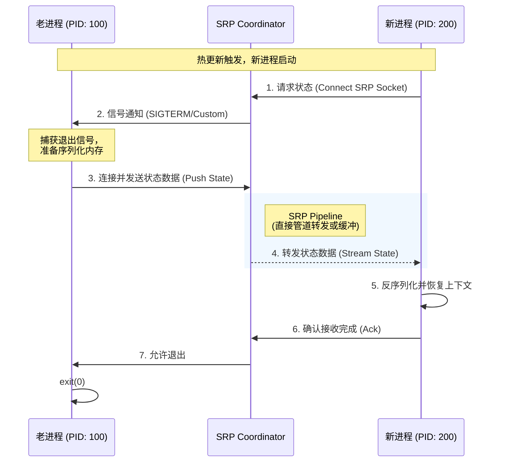

下面是一个完整的、标准化的 API 与协议规范文档，请将其保存为 `docs/apis.md`。该文档遵循 OpenAPI 和二进制协议工程标准，适用于构建第三方集成或进行底层二次开发。

---

# Aeterna API & Protocol Reference

**Version:** 1.0.0

**Status:** Stable

本文档定义了 Aeterna 的三大核心接口界面：

1. **Configuration Schema**: 声明式配置规范 (`aeterna.yaml`)。
2. **HTTP Control API**: 运维监控与控制平面的 RESTful 接口。
3. **State Relay Protocol (SRP)**: 进程间状态无损接力的底层 IPC 协议规范。

---

## 1. Configuration Schema (`aeterna.yaml`)

Aeterna 使用 YAML 作为配置描述语言。以下是字段的详细定义。

### 1.1 Root Object

| Field | Type | Required | Description |
| --- | --- | --- | --- |
| `version` | string | Yes | 配置版本，目前为 `v1`。 |
| `service` | object | Yes | 定义受管业务进程的基本属性。 |
| `orchestration` | object | Yes | 定义热更新策略、健康检查与生命周期钩子。 |
| `observability` | object | No | 定义监控指标与日志配置。 |

### 1.2 Service Object

| Field | Type | Description |
| --- | --- | --- |
| `name` | string | 服务名称，用于日志标识与 Metrics Label。 |
| `command` | array | **[Entrypoint]** 启动命令，例如 `["python", "main.py"]`。 |
| `env` | array | 环境变量列表，格式为 `KEY=VALUE`。Aeterna 会自动注入额外变量。 |
| `binary_path` | string | (Optional) 用于文件完整性校验的二进制路径。 |

### 1.3 Orchestration Object

| Field | Type | Default | Description |
| --- | --- | --- | --- |
| `strategy` | string | `canary` | 更新策略。`immediate` (立即替换) 或 `canary` (带浸泡期的热接力)。 |
| `pre_flight` | array | `[]` | [Phase 1] 前置检查钩子列表。 |
| `startup` | object | - | [Phase 2] 启动阶段配置。 |
| `canary` | object | - | [Phase 3] 金丝雀/浸泡阶段配置。 |
| `drain` | object | - | [Phase 5] 排水阶段配置。 |
| `state_handoff` | object | - | **SRP 核心配置**，定义内存状态接力参数。 |

### 1.4 State Handoff Object (SRP Config)

| Field | Type | Default | Description |
| --- | --- | --- | --- |
| `enabled` | bool | `false` | 是否开启内存状态接力。 |
| `socket_path` | string | `/tmp/aeterna.sock` | 用于传输状态的 Unix Domain Socket 路径。 |
| `timeout` | string | `5s` | 等待老进程导出状态的最大超时时间 (e.g., `500ms`, `10s`)。 |

---

## 2. HTTP Control API

Aeterna 默认在 `:9091` 端口暴露控制平面。支持 Prometheus 抓取与运维干预。

**Base URL:** `http://localhost:9091`

### 2.1 Observability

#### `GET /metrics`

暴露 Prometheus 格式的监控指标。

**Response Content-Type:** `text/plain`

**Key Metrics:**

* `aeterna_process_state`: 当前进程状态 (Gauge: 0=Running, 1=Soaking, etc.)
* `aeterna_handover_duration_seconds`: SRP 状态接力耗时 (Histogram)
* `aeterna_restarts_total`: 发生的重启次数 (Counter)

#### `GET /health`

Liveness 探针接口。

**Response:**

* `200 OK`: Aeterna 守护进程运行正常。
* `503 Service Unavailable`: 内部错误。

### 2.2 Operations

#### `POST /v1/reload`

手动触发热更新流程（功能等同于发送 `SIGHUP` 信号）。

**Request Body:** (Optional)

```json
{
  "reason": "manual_trigger_via_api",
  "force": false
}

```

**Response:**

* `202 Accepted`: 热更新流程已初始化。
* `409 Conflict`: 另一个更新流程正在进行中。

#### `GET /v1/status`

获取当前编排引擎的详细状态机信息。

**Response Example:**

```json
{
  "fsm_state": "RUNNING",
  "current_pid": 1045,
  "old_pid": 0,
  "uptime": "48h20m",
  "last_handover": {
    "status": "success",
    "timestamp": "2023-10-27T10:00:00Z",
    "size_bytes": 1048576
  }
}

```

---

## 3. State Relay Protocol (SRP) Specification

SRP 是 Aeterna 独有的、基于 Unix Domain Socket 的二进制协议，用于在父子进程或新老进程间传输敏感的内存上下文。

### 3.1 Transport Layer

* **Medium:** Unix Domain Socket (SOCK_STREAM)
* **Path:** 由配置文件 `orchestration.state_handoff.socket_path` 指定。
* **Security:** Socket 文件权限必须设置为 `0600` (仅当前用户读写)。

### 3.2 Packet Structure (Frame Format)

为了最大限度兼容 C/C++/Rust/Go/Python，协议采用简单的 **Length-Prefixed** 帧格式。所有整数均为 **Big-Endia (Network Byte Order)**。

```text
 0                   1                   2                   3
 0 1 2 3 4 5 6 7 8 9 0 1 2 3 4 5 6 7 8 9 0 1 2 3 4 5 6 7 8 9 0 1
+-+-+-+-+-+-+-+-+-+-+-+-+-+-+-+-+-+-+-+-+-+-+-+-+-+-+-+-+-+-+-+-+
|                       Length (4 Bytes)                        |
+-+-+-+-+-+-+-+-+-+-+-+-+-+-+-+-+-+-+-+-+-+-+-+-+-+-+-+-+-+-+-+-+
|                        Magic (4 Bytes)                        |
+-+-+-+-+-+-+-+-+-+-+-+-+-+-+-+-+-+-+-+-+-+-+-+-+-+-+-+-+-+-+-+-+
|      Version  |     Type      |           Reserved            |
+-+-+-+-+-+-+-+-+-+-+-+-+-+-+-+-+-+-+-+-+-+-+-+-+-+-+-+-+-+-+-+-+
|                                                               |
|                       Payload (Variable)                      |
|                                                               |
+-+-+-+-+-+-+-+-+-+-+-+-+-+-+-+-+-+-+-+-+-+-+-+-+-+-+-+-+-+-+-+-+

```

* **Length (uint32)**: 整个数据包的剩余长度（不包含 Length 字段本身）。
* **Magic (uint32)**: 固定值 `0xAE7E2024` (标识 Aeterna 协议)。
* **Version (uint8)**: 协议版本，当前为 `0x01`。
* **Type (uint8)**: 消息类型。
* `0x01`: Handshake / Hello
* `0x02`: State Data (JSON)
* `0x03`: State Data (Protobuf - Future Use)
* `0xFF`: ACK / Finished


* **Payload**: 具体的业务数据。

### 3.3 Interaction Flow

1. **Phase 1 (Connect):** 新进程（接收方）作为 Client 连接到 Socket。
2. **Phase 2 (Wait):** 老进程（发送方）收到终止信号，作为 Server 写入数据。
3. **Phase 3 (Transfer):**
* Sender sends: `[Length][Magic][0x01][0x02]...[JSON Data]`


4. **Phase 4 (Close):** 传输完成后，Sender 关闭连接。

---

## 4. Process Contract (Environment Interface)

Aeterna 通过环境变量和文件描述符与子进程建立“契约”。SDK 开发必须遵循此契约。

### 4.1 Environment Variables

| Variable | Description |
| --- | --- |
| `AETERNA_MANAGED` | 固定为 `1`，标识进程由 Aeterna 托管。 |
| `AETERNA_INHERITED_FDS` | **关键**: 继承的文件描述符数量。如果存在且 >0，说明发生了热接力。 |
| `AETERNA_STATE_SOCK` | SRP Socket 的绝对路径，用于 Load/Save State。 |

### 4.2 File Descriptors (FD) Map

当 `AETERNA_INHERITED_FDS` > 0 时，FD 映射如下：

| FD Index | Usage | Note |
| --- | --- | --- |
| `0` | STDIN | - |
| `1` | STDOUT | Redirected to Aeterna Logger |
| `2` | STDERR | Redirected to Aeterna Logger |
| `3` | **Main Listener** | 业务监听 Socket (TCP Listener)。SDK 应直接使用 `fdopen(3)`。 |
| `4+` | Extra | (Optional) 额外的资源描述符。 |


## 实例附件

这份文档定义了用户如何配置 Aeterna，以及 Aeterna 内部组件间通信的协议标准。

### 1. 核心配置规范 (`aeterna.yaml`)

Aeterna 采用声明式配置，定义服务的启动、热更新策略及 AI 状态接力参数。

```yaml
version: "v1"

# -----------------------------------------------------------------------------
# 1. 服务定义 (Service Definition)
# -----------------------------------------------------------------------------
service:
  # 服务唯一标识
  name: "llm-inference-core"
  # 启动命令 (Aeterna 作为父进程将执行此命令)
  command: 
    - "/app/venv/bin/python"
    - "main.py"
  # 环境变量注入
  env:
    - "PORT=8080"
    - "MODEL_PATH=/models/llama3-70b"

# -----------------------------------------------------------------------------
# 2. 编排策略 (Orchestration Strategy)
# -----------------------------------------------------------------------------
orchestration:
  # 更新策略: 'immediate' (立即切换) | 'canary' (金丝雀/浸泡)
  strategy: "canary"

  # [Phase 1] 前置检查: 阻止错误配置上线
  pre_flight:
    - name: "Config Dry-run"
      command: ["/app/venv/bin/python", "main.py", "--check"]
      timeout: "5s"
      # 如果失败是否阻止发布: true (默认)
      block_on_fail: true

  # [Phase 2] 启动参数
  startup:
    # 预热延迟: 允许应用加载模型/缓存的时间
    warmup_delay: "10s"

  # [Phase 3] 金丝雀浸泡: 新老进程并存
  canary:
    enabled: true
    # 浸泡时长: 如果在此期间新进程 crash，自动回滚
    soak_time: "60s"
    # 健康检查 (可选): 期间必须通过 HTTP 探针
    health_check:
      http_get: "http://localhost:8080/health"
      interval: "5s"

  # [Phase 5] 排水: 优雅关闭老进程
  drain:
    timeout: "30s" # 超过此时间发送 SIGKILL

  # [关键特性] AI 状态接力协议 (SRP)
  state_handoff:
    enabled: true
    # 临时 socket 路径，用于新老进程传输内存数据
    socket_path: "/var/run/aeterna/srp.sock"
    # 等待老进程导出内存的最大时间
    timeout: "15s"

# -----------------------------------------------------------------------------
# 3. 可观测性 (Observability)
# -----------------------------------------------------------------------------
observability:
  # Prometheus Metrics 暴露端口
  metrics_port: ":9091"
  # 日志级别: debug, info, warn, error
  log_level: "info"

```

### 2. 状态接力协议 (State Relay Protocol - SRP)

SRP 是 Aeterna 区别于传统 Process Manager 的核心。它定义了新老进程如何通过 Unix Domain Socket 交换内存状态（Context）。

#### 2.1 协议交互流程



#### 2.2 二进制数据帧格式

为了支持多语言，SRP 采用简单的 **Length-Prefixed** 协议：

```text
+----------------+----------------+--------------------------------...+
| Length (4 Byte)| Magic (4 Byte) | Payload (N Bytes JSON/Protobuf) |
+----------------+----------------+--------------------------------...+
| Big Endian Int | 0xAETERNA1     | {"session_id": "...", "hist":..}|
+----------------+----------------+--------------------------------...+

```