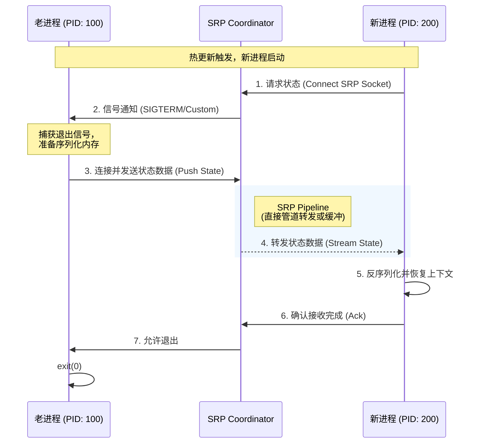

# 任务：外部 OpenAPI 与配置设计

这份文档定义了用户如何配置 Aeterna，以及 Aeterna 内部组件间通信的协议标准。

## 1. 核心配置规范 (`aeterna.yaml`)

Aeterna 采用声明式配置，定义服务的启动、热更新策略及 AI 状态接力参数。

```yaml
version: "v1"

# -----------------------------------------------------------------------------
# 1. 服务定义 (Service Definition)
# -----------------------------------------------------------------------------
service:
  # 服务唯一标识
  name: "llm-inference-core"
  # 启动命令 (Aeterna 作为父进程将执行此命令)
  command: 
    - "/app/venv/bin/python"
    - "main.py"
  # 环境变量注入
  env:
    - "PORT=8080"
    - "MODEL_PATH=/models/llama3-70b"

# -----------------------------------------------------------------------------
# 2. 编排策略 (Orchestration Strategy)
# -----------------------------------------------------------------------------
orchestration:
  # 更新策略: 'immediate' (立即切换) | 'canary' (金丝雀/浸泡)
  strategy: "canary"

  # [Phase 1] 前置检查: 阻止错误配置上线
  pre_flight:
    - name: "Config Dry-run"
      command: ["/app/venv/bin/python", "main.py", "--check"]
      timeout: "5s"
      # 如果失败是否阻止发布: true (默认)
      block_on_fail: true

  # [Phase 2] 启动参数
  startup:
    # 预热延迟: 允许应用加载模型/缓存的时间
    warmup_delay: "10s"

  # [Phase 3] 金丝雀浸泡: 新老进程并存
  canary:
    enabled: true
    # 浸泡时长: 如果在此期间新进程 crash，自动回滚
    soak_time: "60s"
    # 健康检查 (可选): 期间必须通过 HTTP 探针
    health_check:
      http_get: "http://localhost:8080/health"
      interval: "5s"

  # [Phase 5] 排水: 优雅关闭老进程
  drain:
    timeout: "30s" # 超过此时间发送 SIGKILL

  # [关键特性] AI 状态接力协议 (SRP)
  state_handoff:
    enabled: true
    # 临时 socket 路径，用于新老进程传输内存数据
    socket_path: "/var/run/aeterna/srp.sock"
    # 等待老进程导出内存的最大时间
    timeout: "15s"

# -----------------------------------------------------------------------------
# 3. 可观测性 (Observability)
# -----------------------------------------------------------------------------
observability:
  # Prometheus Metrics 暴露端口
  metrics_port: ":9091"
  # 日志级别: debug, info, warn, error
  log_level: "info"

```

## 2. 状态接力协议 (State Relay Protocol - SRP)

SRP 是 Aeterna 区别于传统 Process Manager 的核心。它定义了新老进程如何通过 Unix Domain Socket 交换内存状态（Context）。

### 2.1 协议交互流程



### 2.2 二进制数据帧格式

为了支持多语言，SRP 采用简单的 **Length-Prefixed** 协议：

```text
+----------------+----------------+--------------------------------...+
| Length (4 Byte)| Magic (4 Byte) | Payload (N Bytes JSON/Protobuf) |
+----------------+----------------+--------------------------------...+
| Big Endian Int | 0xAETERNA1     | {"session_id": "...", "hist":..}|
+----------------+----------------+--------------------------------...+

```

---