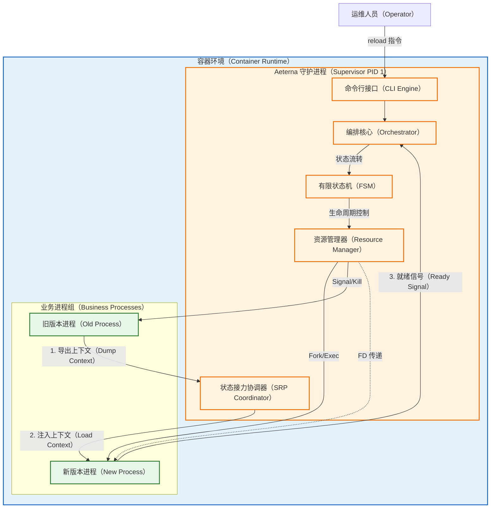

## 1. 架构设计文档


### 1.1 Overview (概述)

Aeterna 采用 **Supervisor/Sidecar 混合模式**。它作为容器内的 PID 1 进程，负责全生命周期管理。其核心设计理念是 **“资源与计算解耦”** —— 操作系统资源（Socket, Shared Memory）由 Aeterna 持有或协调，而业务逻辑（Python/Go/Java 进程）是可随时替换的计算单元。

### 1.2 Core Components (核心组件)

* **CLI Engine (Cobra):** 负责解析用户指令 (`start`, `reload`) 和加载配置。
* **Orchestrator (The Brain):** 系统的决策中枢。它基于 FSM（有限状态机）管理从 `Running` 到 `Handover` 再到 `Soaking` 的状态流转。它决定何时回滚、何时杀掉老进程。
* **Resource Manager (Socket/FDs):** 负责 `net.Listener` 的生命周期管理。在热更新时，它将文件描述符（FDs）通过 `ExtraFiles` 传递给子进程。
* **State Relay Protocol (SRP) Coordinator:** **(AI 核心特性)** 负责建立新老进程间的 IPC 通道（Unix Domain Socket）。它监控状态传输的进度，确保“记忆”被完整接收后才允许老进程退出。

### 1.3 Data Flow Architecture (数据流架构图)



---

## 2. 外部 OpenAPI 与配置设计 (`docs/apis.md`)

### 2.1 Configuration Schema (`aeterna.yaml`)

Aeterna 的行为完全由 YAML 配置驱动。

```yaml
version: "v1"
service:
  # 服务元数据
  name: "llm-inference-agent"
  # 启动命令
  command: ["/app/venv/bin/python", "main.py"]
  env:
    - "MODEL_PATH=/models/llama3"

orchestration:
  # 更新策略
  strategy: "canary" # supported: immediate, canary
  # 浸泡时间：新老进程共存时间，用于观察新进程稳定性
  soak_time: "60s"
  
  # [AI 特性] 状态接力配置
  state_handoff:
    enabled: true
    # 状态传输的 Socket 路径
    socket_path: "/var/run/aeterna-state.sock"
    # 等待状态导出的最大超时
    timeout: "10s"

observability:
  metrics_port: ":9091"
  log_level: "info"

```

### 2.2 IPC Protocol: State Relay (SRP)

为了支持 AI Context 的迁移，Aeterna 定义了简单的 IPC 协议：

1. **Handshake:** 新进程连接 `LIVERELAY_STATE_SOCK`。
2. **Header:** 发送 4 字节长度头。
3. **Payload:** 发送 JSON 或 Protobuf 序列化的状态数据（如 Session ID, Context Vector, User History）。
4. **Ack:** 接收方确认校验无误。

---


## 3. 源文件生成计划列表

以下是完整的项目代码架构规划。

### 3.1 目录结构

```text
Aeterna/
├── cmd/
│   └── aeterna/
│       └── main.go
├── configs/
│   └── aeterna.yaml
├── docs/
│   └── images/
├── internal/
│   ├── cli/
│   │   └── root.go
│   ├── monitor/
│   │   └── metrics.go
│   ├── orchestrator/
│   │   ├── engine.go
│   │   └── engine_test.go
│   ├── resource/
│   │   ├── socket.go
│   │   └── socket_test.go
│   ├── srp/
│   │   └── relay.go
│   └── supervisor/
│       ├── manager.go
│       └── manager_test.go
├── pkg/
│   ├── consts/
│   │   └── types.go
│   ├── errors/
│   │   └── codes.go
│   ├── fsm/
│   │   ├── machine.go
│   │   └── machine_test.go
│   ├── logger/
│   │   └── logger.go
│   └── protocol/
│       └── types.go
├── test/
├── go.mod
└── Makefile
```